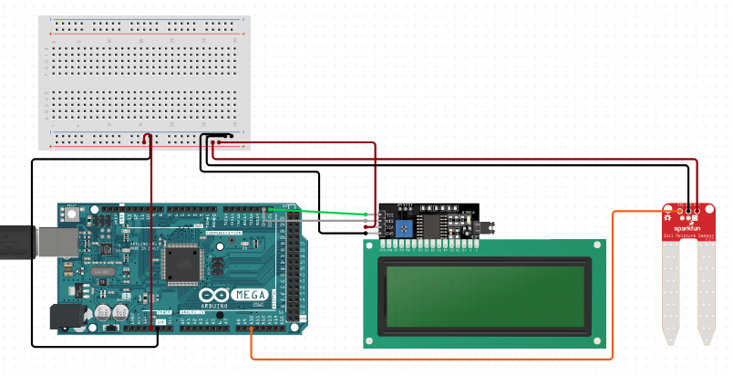

# keba8
- 👋 Hi, I’m @amarianno
- 👀 I’m interested in Arduino, IoT, Robotica

# Projeto

KEBA8 é um projeto que visa dar um feedback visual para donos de plantinhas que querem saber quando regar sua planta. Inspirado no projeto https://www.publico.pt/2019/07/19/p3/noticia/um-vaso-que-te-ajuda-a-nao-matar-plantas-e-ainda-te-sorri-de-volta-1880501

# Componentes

 - Arduino Mega  2560
 - Jumpers
 - Display LCD 20x4 com LCI
 - Sensor de umidade do solo
 - Protoboard mini
 - Papel alumínio

# Arquitetura

 

 
 

<!---
amarianno/amarianno is a ✨ special ✨ repository because its `README.md` (this file) appears on your GitHub profile.
You can click the Preview link to take a look at your changes.
--->
